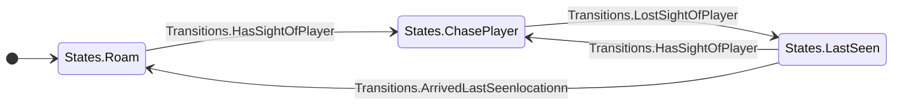
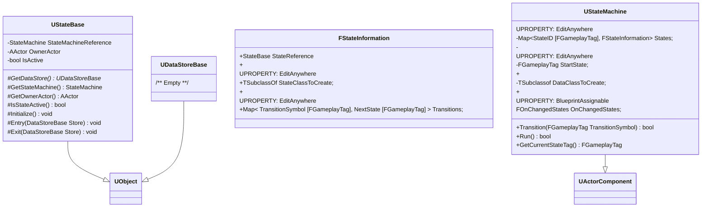

# Implementation of a Deterministic Finite State Automata(DFA)
The objective is to be able to setup a State machine in the editor using GameplayTags and some base classes. Then Run the machine and pass in the appropriate input and it (the machine) will switch to some next state (according to your transition setup). In this demo, we'll be implementing a simple AI chase routine to *randomly roam* or *chase player* based on the update from an *AI Perception component*.
 
 <hr>

# Chase Routine Statemachine

- States (GameplayTags) = { States.Roam, States.ChasePlayer, States.LastSeen }
- Alphabet Σ (GameplayTags) = { *Transitions.HasSightOfPlayer, Transitions.LostSightOfPlayer, Transitions.ArrivedLastSeenlocation* }
- Accepted Inputs (GameplayTags)  = { *Transitions.HasSightOfPlayer, Transitions.LostSightOfPlayer, Transitions.ArrivedLastSeenlocationn* }



<hr>

# StateMachine Base C++ classes definition:



## Blueprint derived classes for AI Chase routine
 ```mermaid
 
classDiagram
 class BP_AICharacter{
    +BP_AIStateMachine
    +AIPerceptionComponent
   }
   
   class BP_AIStateMachine{
    /** We'll setup different States, transitions, start state, and Data store class here **/
    /** NOTE: This class is optional; You could have just added 'UStateMachine' */
    /**       component directly to 'BP_AICharacter' and do your setups there */
   }
   
 class BP_AIDataStore{
    -AActor  SeenPlayer;
    -FVector LastSeenLocation;
   }
   
   class BP_Roam{
    /** Logic: Randomly roam the scene **/
     #Initialize() OVERIDE: void
     #Entry OVERIDE(DataStoreBase Store): void
     #Exit OVERIDE(DataStoreBase Store): void
   }
   
   class BP_ChasePlayer{
    /* Logic: Chase player */
     #Initialize OVERIDE(): void
     #Entry OVERIDE(DataStoreBase Store): void
     #Exit OVERIDE(DataStoreBase Store): void
   }
   
   class BP_LastSeen{
    /* Logic: Move to player's last seen location */
     #Initialize OVERIDE(): void
     #Entry OVERIDE(DataStoreBase Store): void
     #Exit OVERIDE(DataStoreBase Store): void
   }
   
   BP_AIDataStore --|> UDataStoreBase
   BP_Roam --|> UStateBase
   BP_ChasePlayer --|> UStateBase
   BP_LastSeen --|> UStateBase
   BP_AIStateMachine --|> UStateMachine
   BP_AICharacter --|> Character
 ```
 
 <hr>

https://user-images.githubusercontent.com/48392004/157116220-79a08558-a9d5-4673-9903-fa8ff8f5cc28.mp4

<hr>

## States and transition setup in *BP_AIStateMachine*

